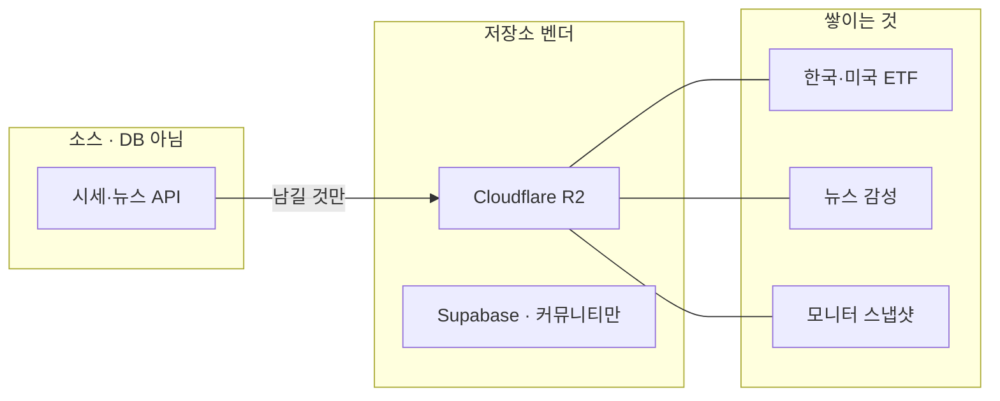

> [!important] 옵시디언이 업그레이드된 게 아닙니다
> 여기에 **우리 프로젝트 데이터가 몇 종류인지** 노트로 옮겨 둔 것입니다.
> 왼쪽에서 `00 홈`과 폴더 `데이터`만 보면 됩니다. (`Cmd+E` 로 읽기 보기)

실제 보관함은 `~/Documents/Obsidian Vault` 입니다. 그쪽도 `02 데이터` 폴더로 같은 묶음입니다.

적재는 Postgres 한 방이 아닙니다. R2 JSON이 **14세트**입니다.

## 데이터 적재 · 관리

왼쪽 폴더 `데이터/`. 화면 탭이 아닙니다.

| 보고 싶은 것 | 노트 |
|---|---|
| 어디에 파일이 있나 | [[01 저장소]] |
| 사용량 · 요금 · 확장 시 청구 | [[용량 비용]] |
| 어떤 DB 벤더인가 | [[05 DB 벤더]] · 그림 [[DB 벤더 지도]] |
| 시세·뉴스를 어디서 가져오나 | [[06 시세 뉴스 API]] · 그림 [[시세 뉴스 API 지도]] |
| 뭘 지우지 않나 | [[02 보존 정책]] |
| 시계열 vs 롤링 | [[04 형태 분류]] |

Yahoo·네이버·FRED 등은 DB가 아닙니다.

## 데이터셋

그림 한 장: [[맵]]

| 보고 싶은 것 | 노트 |
|---|---|
| 한국 ETF AUM·수급 | [[한국 상장 ETF]] |
| 미국 ETF AUM·거래대금 | [[미국 상장 ETF]] |
| 뉴스 제목 점수 | [[종목 뉴스 감성]] |
| 시황 HTML | [[시황 브리프]] |
| 모니터 일별 스냅샷 | [[글로벌 자금 흐름]] · [[CFTC 포지션]] · [[신용 자금]] |
| 단기예측 검증 (BTC) | [[단기예측 검증]] |

웹에서 같은 목록: [적재 현황](https://savvyetf.com/?tab=datacatalog) (관리자)

## 이 보관함

| 보고 싶은 것 | 노트 |
|---|---|
| 숫자 합치면 안 되는 것 | [[03 인사이트 규칙]] |
| 혼자 보기 / 웹 공유 | [[07 옵시디언 활용]] |
