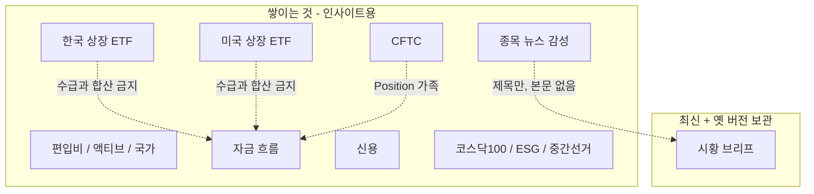

> [!important] 옵시디언이 업그레이드된 게 아닙니다
> 여기에 **우리 프로젝트 데이터가 몇 종류인지** 노트로 옮겨 둔 것입니다.
> 왼쪽 파일 목록에서 `00 홈`과 `맵`만 보면 됩니다. (`Cmd+E` 로 읽기 보기)

적재는 Postgres 한 방이 아닙니다. R2 JSON이 **14세트**입니다.

클릭해서 들어가기:

| 보고 싶은 것 | 노트 |
|---|---|
| 한국 ETF AUM·수급 | [[한국 상장 ETF]] |
| 미국 ETF AUM·거래대금 | [[미국 상장 ETF]] |
| 뉴스 제목 점수 | [[종목 뉴스 감성]] |
| 시황 HTML | [[시황 브리프]] |
| 모니터 일별 스냅샷 | [[글로벌 자금 흐름]] · [[CFTC 포지션]] · [[신용 자금]] |
| 그림으로 한 장 | [[맵]] |
| 어디에 파일이 있나 | [[01 저장소]] |
| 뭘 지우지 않나 | [[02 보존 정책]] |
| 숫자 합치면 안 되는 것 | [[03 인사이트 규칙]] |

웹에서 같은 목록: [적재 현황](https://savvyetf.vercel.app/?tab=datacatalog)
