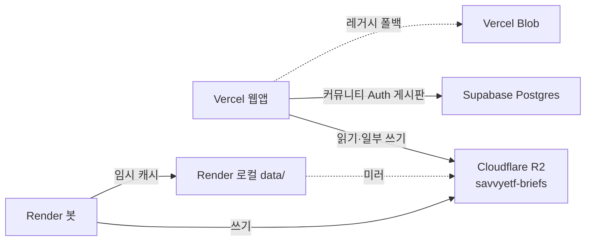

# DB 벤더

금융용 Postgres·Redis·Mongo는 없습니다. 연동된 저장소 벤더는 셋입니다.

그림: [[DB 벤더 지도]] 캔버스.

## 목록

| 벤더 | 제품 | 역할 |
|---|---|---|
| **Cloudflare** | R2 | 정본. ETF·NLP·브리프·모니터 JSON. 버킷 `savvyetf-briefs` |
| **Supabase** | Postgres + Auth | 커뮤니티 로그인 게시판만 (`profiles` / `posts` / `comments`) |
| **Vercel** | Blob | R2 없을 때 브리프 폴백 |

Yahoo·네이버·FRED·Finnhub·DART는 시세·뉴스 API이지 DB가 아닙니다.

관련: [[01 저장소]] · [[00 홈]]
